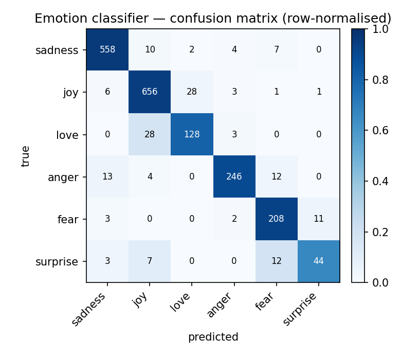

# distilbert-emotion

**🔗 Live demo:** [try it on Hugging Face Spaces](https://huggingface.co/spaces/LaelaZ/distilbert-emotion) — type a sentence, watch the model name the emotion.
**🤗 Model on the Hub:** [LaelaZ/distilbert-emotion](https://huggingface.co/LaelaZ/distilbert-emotion) — with a model card, ready to `pipeline("text-classification", ...)`.

I fine-tuned **DistilBERT** to read a sentence and name the feeling behind it: one of six
emotions (sadness, joy, love, anger, fear, surprise). This is the NLP / transformers piece
of my portfolio, and it follows the same discipline as the rest: I do not just ship the
model, I **report how well it actually works on held-out data and where it fails**.

## I built it and I verified it

I evaluated the fine-tune on the **held-out test set** (2,000 sentences the model never
trained on) and report accuracy alongside **macro and weighted F1**. Macro F1 matters here
because the emotion classes are imbalanced (joy and sadness dominate, surprise is rare), so
accuracy alone would hide weakness on the rare classes.

<!-- METRICS:START -->
**Held-out test set (2,000 examples):**

| metric | score |
|---|---|
| accuracy | **0.920** |
| macro F1 | **0.874** |
| weighted F1 | **0.920** |

Per-class F1: sadness 0.96, joy 0.94, anger 0.92, fear 0.90, love 0.81, surprise 0.72.
The two weakest classes are the two rarest (love n=159, surprise n=66), which is exactly
why macro F1 (0.874) sits below accuracy (0.920): accuracy is carried by the easy, frequent
classes, while macro F1 weights every class equally and exposes the rare-class weakness.
Reproduce with `python -m emotion.evaluate`.
<!-- METRICS:END -->

I also surface the model's **confidently wrong** predictions, because a model that is wrong
*loudly* is more dangerous than one that is wrong quietly. Those are the cases worth reading.

## Where it actually fails

I don't stop at a headline number. `python -m emotion.error_report` runs the shipped weights
over the **full 2,000-example test set** and writes a confusion matrix, per-class
precision/recall/F1, and the highest-confidence mistakes to
[`reports/error_analysis.md`](reports/error_analysis.md).



The single largest error axis is **joy ↔ love** (28 + 28 mutual misclassifications): both are
short, affect-positive messages, so the model leans toward the higher-frequency neighbour. The
rarest class, `surprise` (n=66, F1 0.72), leaks mainly into `fear` and `joy`. The errors are
semantically adjacent rather than random — the model is losing the low-support classes, not
misfiring broadly — which is the honest limitation to know before deploying it.

## Why this repo is more than "it trains"

The shipped checkpoint is guarded by a **test** (`test_finetuned_clears_f1_bar`): it loads
the real model, evaluates a slice of the test set, and fails CI if accuracy or macro F1 drop
below a bar. So a regressed or corrupted model breaks the build, not the live demo. The fast
tests verify the data contract and the prediction post-processing with a stub model, so they
run offline in under a second.

```
tests/test_emotion.py
  test_label_maps_are_consistent          # id<->label mapping is correct
  test_predict_returns_probability_distribution  # softmax sums to 1, labels complete
  test_predict_one_picks_argmax_label      # top label == argmax
  test_predict_accepts_single_string       # str and list inputs both work
  test_finetuned_clears_f1_bar             # shipped model holds accuracy/F1 (skips if absent)
```

## Use the model

```python
from transformers import pipeline
clf = pipeline("text-classification", model="LaelaZ/distilbert-emotion", top_k=None)
clf("i can't stop smiling, today went better than i ever hoped")
# -> [{'label': 'joy', 'score': 0.99}, ...]
```

## Train / evaluate / run it

```bash
pip install -r requirements.txt
python -m emotion.train --train-size 5000 --epochs 3   # fine-tune, saves model/
python -m emotion.evaluate                             # held-out accuracy + F1 + failures
pytest -q                                              # data + prediction + F1-bar tests
python app.py                                          # launch the Gradio demo locally
```

## Layout

```
emotion/
  data.py      # emotion dataset loading (dair-ai/emotion) + label maps
  model.py     # load fine-tuned model/tokenizer (local or Hub) + predict
  train.py     # fine-tune distilbert-base-uncased -> 6 emotion classes
  evaluate.py  # held-out accuracy, macro/weighted F1, per-class, confidently-wrong
tests/         # data contract + prediction logic + F1-bar guard
app.py         # Gradio demo (type a sentence -> emotion probabilities)
model/         # shipped fine-tuned weights + tokenizer
```

Base model: `distilbert-base-uncased`. Dataset: `dair-ai/emotion`. Part of my ML portfolio
(build + evaluate). License: MIT.
